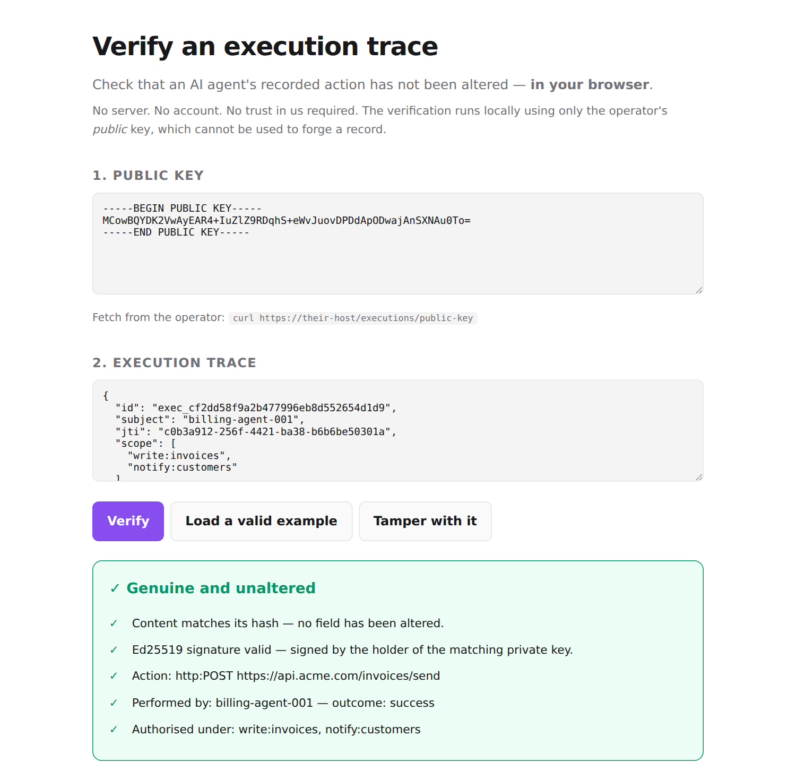
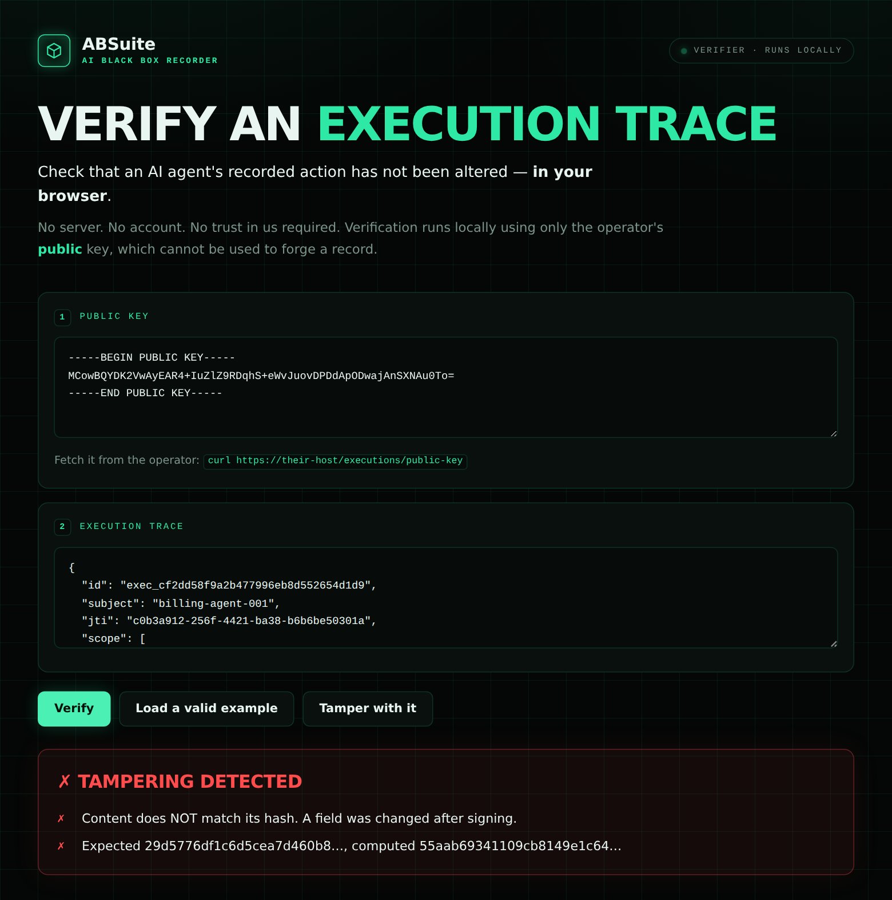

# ABSuite

> **The trust layer for autonomous systems.**
>
> It observes, verifies, governs, and explains intelligence.
>
> **ABSuite does not tell you what to believe. It tells you what can be proven.**

Every verb above is backed by code, tests and doctrine — not by a plan.
`observe` is a signed, hash-chained execution record. `verify` is Ed25519 against
a public key that cannot forge. `govern` is the rule that permitted an action,
signed alongside it. `explain` is derived from those fields deterministically, by
no language model at all.

**Nothing may look more complete, more certain, or more authoritative than it
actually is.** That is the root every other principle here derives from, and it
applies to this page as much as to a record.

**Observation is automatic. Action is granted.** Nobody switches trust on; the
moment a human has to remember to enable it, it has already failed. Humans
decide what an AI may do. ABSuite makes sure nobody can forget what it did.

ABSuite is not the intelligence — it is the witness. *The future is accountable.*

```bash
npm install @absuitecore/capkit
```

```js
import { SigningKey, TraceStore, Storage, verifyTrace } from '@absuitecore/capkit';

const { key, publicKeyPem } = SigningKey.createPair();
const traces = new TraceStore(new Storage('./audit.db'), key);

const trace = traces.record({
  subject: 'agent:invoicing', scope: ['payment:approve'],
  module: 'payments', action: 'approve_batch', outcome: 'success',
  input: { batch: 'BATCH-8891', total: 250000 },   // hashed here, never stored
});

verifyTrace(trace, publicKeyPem).valid;   // true — Ed25519, not a log line
traces.verifyChain(publicKeyPem);         // names the first tampered record
```

Every action is signed and hash-chained, so anyone can check the record —
including people with no reason to trust you. Payloads are hashed, never stored:
the record proves what happened without becoming a copy of your data.

**[Getting started →](./GETTING-STARTED.md)** · **[Run the full incident investigation →](./examples/incident-forensics.mjs)**

[](https://www.npmjs.com/package/@absuitecore/capkit)
[](https://www.npmjs.com/package/@absuitecore/trust)
[](https://www.npmjs.com/package/@absuitecore/capkit)
[](https://www.npmjs.com/package/@absuitecore/capkit#provenance)
[](https://github.com/iamGodofall/ABSuite-core/actions/workflows/ci.yml)
[](LICENSE)
[](https://nodejs.org/)

---

## Questions ABSuite answers

| | |
|---|---|
| **What happened?** | A signed, hash-chained execution trace of every real action |
| **Who or what did it?** | The subject of the capability token that authorised it |
| **Was it authorised?** | Segment-wise scope matching, enforced in every service |
| **What evidence supports the output?** | Claims checked against sources — `SUPPORTED`, `UNVERIFIED` or `CONTRADICTED` |
| **Has the record been modified?** | Chain verification names the sequence number of the first broken record |
| **Can it be reproduced?** | Replay compares a re-run against the recorded hashes |
| **Should someone investigate?** | Counts you can contest line by line, never a score |

None of these answers require trusting the operator. That is the whole design.

---

## The stack

**ABSuite is the trust layer for autonomous systems: eight architectural layers,
powered by a seven-stage operational loop.**

Two different questions, two different answers, and both are needed. The layers
ascend — what this becomes, over years. The loop recurses — what it does, every
second it is running. Without the layers there is no destination; without the
loop there is no behaviour.

### The loop — what it does now

A recorder records. A trust layer observes, verifies, explains, governs,
arbitrates, acts and learns, then observes again. The recorder is one component;
these seven are the system, and they are also the seven screens of the console —
a product whose navigation does not match its architecture is telling two
different stories.

| | | |
|---|---|---|
| 1 | **Observe** | What did the agents do? — subject, authority, steps, hashes |
| 2 | **Verify** | Has any of it been altered? — Ed25519, hash chains, replay |
| 3 | **Explain** | What does this record mean? — derived from signed fields, no model |
| 4 | **Govern** | What is it allowed to do? — policies, scopes, refusals enforced by tests |
| 5 | **Arbitrate** | Who is right when they disagree? — correlation-discounted, weight shown |
| 6 | **Act** | What can it reach? — MCP, edge execution, connectors, under capability |
| 7 | **Learn** | How fast is it, really? — measured, with the machine stated |

Each stage has something tangible behind it, today:

| Stage | What implements it |
|---|---|
| Observe | A signed, hash-chained execution trace |
| Verify | Ed25519 signature and chain verification, public key only |
| Explain | A deterministic renderer — no model, every sentence names its field |
| Govern | A signed policy reference: rule, version, decision, conditions checked |
| Arbitrate | Correlation discounting across model families, weights shown |
| Act | Execution under capability — MCP, edge-run, connectors |
| Learn | Measured baselines and regression detection against the previous run |

Two of those stages carry a rule that costs us something:

**Explanation is derived, never generated.** Using an LLM to explain a trace
would stack a second black box on the first — a new claim, from reasoning nobody
can inspect, about a record whose whole value is that its reasoning *can* be
inspected. A generated explanation would be more impressive. A derived one is
checkable.

**No number is published that a measurement did not produce.** Every figure names
the machine it came from, or it does not appear. This is the worst possible
project to be caught rounding up.

**Unknown is not the same as false — or true.** Four states, not two:
`DEMONSTRATED`, `FAILED`, `UNKNOWN` and `ABSENT`. Not true/false/null, because
true and false are claims about the world and this system only makes claims
about evidence. A build too old to read a record has not caught anyone
tampering; a signature nobody checked has not been disproved *or* confirmed.

**Every unknown carries its path to resolution.** Uncertainty without a next
step is paralysis; with one it is work. Constructing an unknown without a
resolution throws — as does an absence that does not say why the record is
silent.

**Evidence composes pessimistically.** Four conditions demonstrated and one
failure is not "mostly trustworthy"; it is a record with a failure in it. Claims
shrink to fit uncertainty — a claim wider than its evidence is not a claim, it
is a hope. Every report states
the strongest claim it can still defend and names what constrains it. A system
is not defined by the evidence it possesses, but by what it can still defend
after accounting for what it does not know.

**A record says under what rule, never whether the rule was right.** Given a
policy whose content is indefensible, ABSuite reports the action as permitted
under that policy in exactly the same words it uses for any other — because a
record that editorialised about which rules it approved of could not be trusted
about the ones it liked either. Recording a rule is not endorsing it; it is
naming it, versioning it and making it attributable in a record its author
cannot edit. Judgement stays with people. Making sure they have something to
judge is the job.

And Learn returns to Observe, or it is not a loop: every benchmark run is
compared against the previous run on the same machine, with Welch's t-test
deciding whether a change is real rather than noise. The comparison refuses to
run across different hardware, different Node versions, or an operation whose
workload changed — a regression alert that fires on a machine swap gets muted
within a week, and then the real one arrives and nobody looks.

### The layers — what it becomes

| | | | |
|---|---|---|---|
| 1 | **Identity** | Every agent, model and human has one that survives restarts | Partly built |
| 2 | **Capability** | Authority granted narrowly, expiring, revocable | Built |
| 3 | **Evidence** | Claims checked against sources — supported, unverified, contradicted | Built |
| 4 | **Trust** | Records accumulate into facts about behaviour — counts, never scores about people | Built |
| 5 | **Governance** | Policies, obligations, approvals, and the workflows humans run it with | Partly built |
| 6 | **Autonomy** | ABSuite's own agents watch the record and raise what a person should see | Partly built |
| 7 | **Collective Intelligence** | Independent deployments verify each other without merging | Not built |
| 8 | **Civilization** | Millions of agents, autonomous economies, planetary-scale accountability | Not built |

The last column is the point. A roadmap that does not mark what is shipped is a
wish list wearing an architecture diagram.

Layer 8 is a claim about a question, not about us: at that scale somebody has to
answer *who did what, under whose authority, using what evidence, according to
which rules* — and that question gets larger as autonomy grows, not smaller.
Whether ABSuite is what answers it is not something a README gets to assert.

### Architecture defines capability. Runtime defines behaviour.

The two models are never zipped together. A building and a heartbeat don't need
the same number of floors: Governance is a layer, Govern is an operation; Trust
is a property, Arbitrate is an operation. **Every layer participates in the loop
according to its nature** — the matrix, in three states (built, partly built,
planned), is in [the Constitution](./docs/CONSTITUTION.md).

Keeping them separate is also what lets them evolve apart. The loop could gain
stages — simulate, negotiate, coordinate — without a layer changing; Civilization
could split into planetary and beyond without touching the loop.

### Claims are architecture. Checks are implementation.

Everything above is a claim. These are the checks that make the claims cost
something, and they are the part worth believing:

| Claim | The check |
|---|---|
| No number is published that a measurement did not produce | CI fails if the benchmark data, `docs/PERFORMANCE.md` and the table above disagree |
| A comparison across machines or workloads is meaningless | `compareReports()` refuses it and says why, instead of producing a number |
| The seven refusals are behaviour, not marketing | `pnpm check:constraints` fails if the test behind any refusal is renamed |
| Built and planned are different words | `pnpm check:doctrine` fails if a layer claimed as built stops naming a file that exists |
| History must survive improvement | A chain signed in January 2026 is committed, and must still verify — forever |
| Unknown is not the same as false, or true | Four states; the vocabulary contains no TRUE, FALSE or VALID |
| Every unknown carries its path to resolution | Constructing one without a resolution throws |
| Evidence composes pessimistically | The overall finding is the weakest condition, never an average |
| Every documented route exists | The CapKit smoke suite asks the running server for each one |

A principle that cannot fail a build is a preference — and adding one now
requires a failing test that proves its absence, checked by `check:doctrine`.

Five roots, and everything else derives from them:

1. **Trust must be verifiable.**
2. **History must survive improvement.**
3. **Nothing may look more complete, more certain, or more authoritative than it actually is.**
4. **Evidence composes pessimistically.**
5. **Every unknown must carry its path to resolution.**

Fifty years from now nobody will remember why `complete: true` exists. They will
understand the third one, and it explains almost every choice here: this system
refuses to pretend.

**Context is part of the evidence.** Verified against which key; unknown
resolved by what; absent because of what; measured on which machine; counted out
of how many, and whether the list was truncated. A claim without its conditions
is not a smaller claim — it is a different one. Every report carries the build,
the moment and the scope that produced it, because the software will not be
there in 2046 to explain itself.

**And there is no severity field anywhere.** Severity is context, and context
belongs to whoever holds it. "HIGH: missing governance" — according to whom?
Infrastructure that invents severity is making decisions on behalf of people who
never delegated them. The system provides evidence, constraints, unknowns and
their resolutions; priorities, values, policy and judgement are yours.

---

## Verify it yourself, right now

[**iamgodofall.github.io/ABSuite-core/verify.html**](https://iamgodofall.github.io/ABSuite-core/verify.html)
checks a real signed execution trace entirely in your browser using WebCrypto.
No install, no account, no server, no trust in this project. Click *Load a valid
example*, then *Tamper with it*, and verify again.

 

One field edited is all it takes. The page names the expected hash and the
computed one, so the disagreement is visible rather than asserted.

---

## Why this exists

Most AI governance products ask *can we trust the model?* ABSuite asks the
question that has an answer: **can we trust the evidence around the model?**

### A hash chain is not a signature

This is the distinction the whole project turns on, and it is worth being
precise about because plenty of audit tools stop one step short of it.

Hash-chaining links each record to the one before it, the way git commits are
linked. Edit history and verification fails. That is genuinely useful, and it is
what most tamper-evident audit logs provide.

**It proves a record was not edited afterwards. It does not prove who wrote
it.** Anyone holding the log — including the operator being audited — can
construct a perfectly valid hash chain containing whatever they like. If the
question is *"did this company fabricate its own audit trail?"*, a hash chain
cannot answer it.

ABSuite hash-chains **and** signs each record with **Ed25519**. Verification
needs only the public key, and a public key cannot produce a signature. So the
operator cannot fabricate history, and the auditor cannot fabricate an
accusation. That asymmetry is the product.

### Four things that only work together

| | Without it |
|---|---|
| **Attestation** | You have logs, not evidence |
| **Enforcement** | You record violations you could have prevented |
| **Replay** | You cannot show what actually happened, only what was written down |
| **Independent verification** | You have proof for yourself and nobody else |

ABSuite does all four.

### Evaluating this against anything else

Good alternatives exist and several are excellent at what they do. Rather than
publish a scorecard — which would be us grading competitors on axes we chose,
going stale within weeks — here are the questions to put to **any** tool in this
space, including this one. Every answer is checkable from public documentation.

| Ask | Why it matters | ABSuite |
|---|---|---|
| Are records **signed**, or only hash-chained? | A chain proves no edit; only a signature proves authorship | Ed25519 signed **and** chained |
| Can a verifier check without being able to forge? | Symmetric secrets let the auditor fake evidence too | Yes — public key verifies, cannot sign |
| Can it **refuse** an unauthorised action, or only record it? | Recording a breach you could have blocked is not governance | Refuses before execution |
| Is verification possible **offline**, with no vendor? | A proof you need the vendor to check is a promise | Yes — [one HTML file](./docs/verify.html) |
| Are payloads **stored** or hashed? | Storing them makes your audit log a second copy of your data | Hashed, never stored |
| What does it say when evidence is **absent**? | "Low confidence" and "unverified" are different claims | `UNVERIFIED` — absent, not false |

If something else answers these better, use it. These are the criteria that
matter whoever wins them, and getting them into more people's evaluation
checklists is worth more to us than winning a table we drew ourselves.

---

## Security

Trust infrastructure has to be held to its own standard, so the security posture
is documented rather than implied.

**Guarantees.** Forging a trace that verifies against a public key without the
private key; modifying a stored record while `verifyChain()` still reports the
chain intact; obtaining a scope a token does not grant. Anything breaking one of
those is a vulnerability — see [`SECURITY.md`](./SECURITY.md) for the full scope
and private reporting.

**Deliberate choices, not oversights:**

- Traces are **Ed25519-signed, not HMAC'd**, so a verifier cannot also forge.
- The revocation store **fails closed** — unreachable means `503` and nothing is
  authorised. Availability is worth less than the guarantee.
- Script execution, human trust scoring and public signup are each **off unless
  explicitly enabled**, because each mints capability or judgement.
- API keys are stored **SHA-256 only** and shown exactly once.
- Every compose port binds to **`127.0.0.1`**. The dashboard holds the admin key
  and mounts the Docker socket — [what it is granted, and how to drop each
  grant](./docs/SECURITY-MODEL.md#what-the-dashboard-is-granted).

**Verify what you installed.** Every package is published from CI with a signed
Sigstore attestation:

```bash
npm audit signatures
```

That checks the tarball against the commit and workflow that produced it — the
same thing this project asks you to demand of your AI systems.

Full threat model: [`docs/SECURITY-MODEL.md`](./docs/SECURITY-MODEL.md).
Reporting a vulnerability: [`SECURITY.md`](./SECURITY.md).

---

## What it refuses to do

Most projects document what they do. This one also documents what it will not
build, because the refusals are the design.

**No hallucination detection.** Deciding whether an arbitrary statement is true
is open-domain fact-checking. Nobody can do it, and a product claiming to is a
classifier with a confident voice. ABSuite reports whether a claim traces to a
supplied source — `UNVERIFIED` means the evidence is absent, **not** that the
claim is false.

**No trust scores for people.** ABSuite will not tell you John scores 42. It
reports events recorded, policy violations, manual overrides and audit findings
— facts he can check and contest, line by line. The record object has no `score`
field and cannot be given one.

**No confidence as proof.** Agreement between models is not evidence. Arbitration
discounts correlated agreement, and a leader that only wins because three
witnesses share a model family does not win.

**No hidden verification.** The verification path is free, offline-capable and
permanently open. A proof you must pay to check is not a proof.

**No deciding what should happen.** ABSuite is the witness — present at every
action, party to none of them. It decides what a human should *look at*; it does
not decide what should be *done*. A witness that decides outcomes is a party to
the events, and then the question is who witnesses the witness.

**No learning what to distrust.** It may improve how it works. It may not learn
who to suspect. Every conclusion has to be re-derivable from stored records by
someone who does not trust ABSuite, and a learned weight is not re-derivable.

The reasoning is in [`PRINCIPLES.md`](./PRINCIPLES.md) and
[`docs/CONSTITUTION.md`](./docs/CONSTITUTION.md).

---

## Packages

All seven are published with signed Sigstore provenance attestations — you can
verify which commit and workflow produced each tarball without trusting us
(`npm audit signatures`).

| Package | What it does |
|---|---|
| [`@absuitecore/capkit`](https://www.npmjs.com/package/@absuitecore/capkit) | Capability tokens, tamper-evident audit, signed execution traces, tenancy |
| [`@absuitecore/trust`](https://www.npmjs.com/package/@absuitecore/trust) | Evidence validation, chain monitoring, arbitration, reciprocal contracts |
| [`@absuitecore/edge-run`](https://www.npmjs.com/package/@absuitecore/edge-run) | Scheduling, priority queue, retries with jitter, circuit-breaker self-healing |
| [`@absuitecore/quickbench`](https://www.npmjs.com/package/@absuitecore/quickbench) | LLM and HTTP benchmarking, nearest-rank percentiles, regression detection |
| [`@absuitecore/connector-starter`](https://www.npmjs.com/package/@absuitecore/connector-starter) | Connector registry, read-only credential verification, deterministic scaffolding |
| [`@absuitecore/mcp`](https://www.npmjs.com/package/@absuitecore/mcp) | MCP server — puts ABSuite inside the tool-calling path |
| [`@absuitecore/cli`](https://www.npmjs.com/package/@absuitecore/cli) | The `absuite` command |

Code for each is in [`docs/MODULES.md`](./docs/MODULES.md).

### What makes it a suite, not six services

CapKit is the shared authorisation layer. Every other service imports
`capabilityGuard` from `@absuitecore/capkit` and enforces the same capability
model, so **one token works everywhere, and revoking it at CapKit locks it out
of all of them**. Enforcement lives in a library distributed to every service
rather than in a gateway, because a gateway leaves each service unguarded to
anything that reaches it directly.

As services, they listen on 8081 (CapKit), 8082 (Edge-Run), 8083 (QuickBench),
8084 (Connector-Starter), 8085 (Trust) and 3001 (Dashboard). Full design in
[`docs/ARCHITECTURE.md`](./docs/ARCHITECTURE.md).

---

## The path an action takes

```text
  Input
    │
    ▼  capability check        capabilityGuard() — refused here, or it never runs
    ▼  execution               the action itself
    ▼  evidence check          verifyOutput() — claims against their sources
    ▼  hash + sign             Ed25519; payloads hashed and dropped, never stored
    ▼  chain append            linked to its predecessor, in one transaction
    ▼  verification            verifyChain() — public key only, no server
    ▼  where to look           GET /anomalies — stalls, runaways, disagreement
    ▼  contest it              POST /events/:id/appeal — upheld, it repairs the record
    │
    └─► audit history
```

Each step names the thing that performs it. Nothing in that column is
aspirational — the routes exist, and [`docs/API.md`](./docs/API.md) lists all 102.

---

## How fast it is

Measured, not estimated. `pnpm bench:core` runs the real signing, storage and
verification paths — no stubs — and writes the numbers below. On a 4-vCPU
Intel Xeon @ 2.80GHz, Node 22.22.2:

<!-- BENCH:START — generated by scripts/gen-performance-doc.mjs. Do not edit by hand. -->
| Operation | ops/sec | p50 | p95 | p99 |
|---|---:|---:|---:|---:|
| Sign an execution into the chain | 606 | 1.27 ms | 2.48 ms | 6.53 ms |
| Verify a record (Ed25519 + hash) | 5,216 | 0.17 ms | 0.3 ms | 0.64 ms |
| Verify the whole chain | 6 | 171.2 ms | 201.9 ms | 201.9 ms |
| Issue a capability token | 50,634 | 0.02 ms | 0.03 ms | 0.05 ms |
| Check a capability | 39,508 | 0.02 ms | 0.04 ms | 0.09 ms |
| Explain a record | 5,458 | 0.17 ms | 0.25 ms | 0.32 ms |
<!-- BENCH:END -->

Your machine will give different numbers — that is why ours is stated. The
table is generated from [`bench/core-latest.json`](./bench/core-latest.json) and
CI fails if the document and the data disagree, so a figure cannot be edited
into something friendlier. Full method and caveats:
[`docs/PERFORMANCE.md`](./docs/PERFORMANCE.md).

There is no performance claim anywhere in this repository that did not come out
of that command.

---

## Where the name came from

ABSuite began as a black box recorder for AI — a flight recorder, not an opaque
model. That framing got it in the door and it is still the fastest way to explain
the first capability to someone new.

It is no longer what the project is. A recorder records; this observes, verifies,
explains, governs, arbitrates, acts and learns, and the recorder is one component
of seven. The audit log, the tracing, the monitoring — all subsystems now. What
grew around them is closer to evidence infrastructure: a system whose job is to
say what can be proven and, just as loudly, what cannot.

The shift in one line — before: *we record what happened*. Now: *we tell you what
can be proven*.

---

## Status

```text
495 tests                    103 API endpoints
7 npm packages on npm         6 HTTP services + MCP server
API docs drift-checked in CI  published from CI with provenance
```

Numbers are generated, not claimed: run `pnpm test` and `pnpm docs:check`.

## Run the room

```bash
pnpm install && pnpm build && pnpm room
```

Starts all six services and the orchestrator, then serves the Trust Operations
Center at **http://localhost:3001**. A copy of the interface with nothing behind
it reports *No instance connected* rather than a failure — it reads live
services and shows UNKNOWN for anything it cannot reach, and never substitutes a
figure for a gap.

To put an instance at a public address, `deploy/Dockerfile` builds all six
services and the room into a single container — `fly deploy`, a Render
blueprint, or `docker run` anywhere. Set `ABSUITE_PUBLIC_PASSWORD` first: that
process holds the key that mints capability tokens. See **[docs/DEPLOY.md](docs/DEPLOY.md)**.

It is installable. Nobody outside the project has used it yet — that is the
honest state, and [`docs/ROADMAP.md`](./docs/ROADMAP.md) says so plainly.

---

## Documentation

| | |
|---|---|
| [Getting started](./GETTING-STARTED.md) | Library, HTTP API and Docker — every command verified |
| [Modules in code](./docs/MODULES.md) | What each package looks like to use |
| [API reference](./docs/API.md) | Every route, generated from source |
| [Architecture](./docs/ARCHITECTURE.md) | How the pieces fit together |
| [Performance](./docs/PERFORMANCE.md) | Measured throughput and latency, with the machine |
| [Principles](./PRINCIPLES.md) | The rules the code is held to |
| [Constitution](./docs/CONSTITUTION.md) | What this will never become |
| [Security model](./docs/SECURITY-MODEL.md) | Threat model and defence in depth |
| [Reporting a vulnerability](./SECURITY.md) | Private disclosure |
| [Code of conduct](./CODE_OF_CONDUCT.md) | How people are expected to treat each other |
| [Roadmap](./docs/ROADMAP.md) | What is next, and what is deliberately refused |
| [UI overhaul brief](./docs/UI-OVERHAUL-BRIEF.md) | 103 endpoints built, 18 reachable — the interface gap, in detail |
| [Changelog](./CHANGELOG.md) | Including the bugs, and how they were found |

---

## Contributing

Open an issue before writing anything beyond a small fix — it avoids duplicate
work and makes disagreement about design cheap. Every command in
[`CONTRIBUTING.md`](./CONTRIBUTING.md) has been run against this repository; if
one does not work, that is a bug and a PR fixing it needs no issue.

Contributions are held to the principles above. Anything that scores a person,
or treats model agreement as evidence, will be declined however well argued.

Security vulnerabilities go to [private disclosure](./SECURITY.md), never the
issue tracker. How people are expected to treat each other is in
[`CODE_OF_CONDUCT.md`](./CODE_OF_CONDUCT.md).

---

## License

[MIT](./LICENSE). Copyright © 2025–2026 ABSuite Contributors.

The verification path stays free and open, permanently. That is a commitment in
[the Constitution](./docs/CONSTITUTION.md), not a pricing decision.

---

<p align="center">
  <strong>Record what happened. Prove it happened. Preserve the evidence.</strong>
</p>
